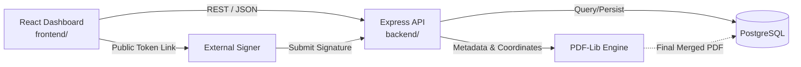
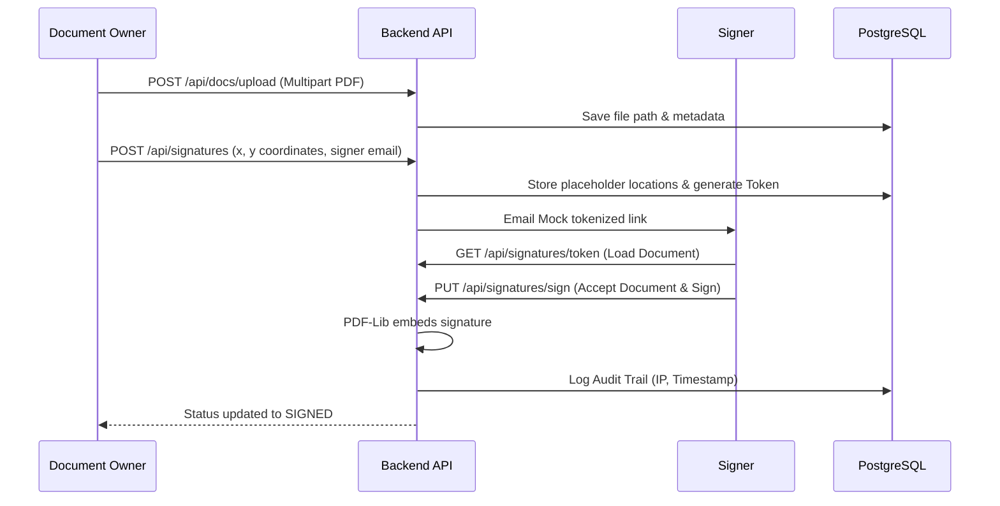
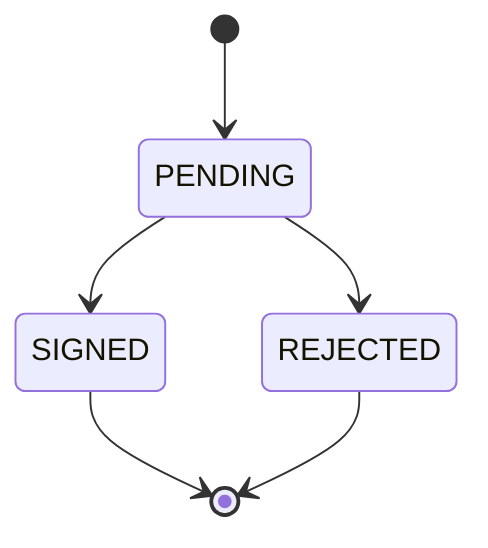
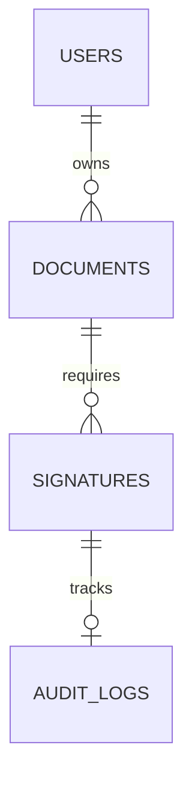

<h1 align="center">✍️ Document Signature WebApp</h1>

<p align="center">
  
</p>

<p align="center">
  A secure, full-stack web application that enables users to upload documents, place digital signatures, share signing links, and generate legally traceable signed PDFs — similar to platforms like DocuSign and Adobe Sign.
</p>

<p align="center">
  <a href="#"></a>
  <a href="#"></a>
  <a href="#"></a>
  <a href="#"></a>
  <a href="#"></a>
</p>

## Tech Stack Icons (Large)

<table align="center">
  <tr>
    <td align="center" width="130">
      <br />
      <strong>React</strong>
    </td>
    <td align="center" width="130">
      <br />
      <strong>Node.js</strong>
    </td>
    <td align="center" width="130">
      <br />
      <strong>Express.js</strong>
    </td>
    <td align="center" width="130">
      <br />
      <strong>PostgreSQL</strong>
    </td>
  </tr>
  <tr>
    <td align="center" width="130">
      <br />
      <strong>Tailwind CSS</strong>
    </td>
        <td align="center" width="130">
      <br />
      <strong>PDF-Lib</strong>
    </td>
    <td align="center" width="130">
      <br />
      <strong>Git</strong>
    </td>
    <td align="center" width="130">
      <br />
      <strong>Figma</strong>
    </td>
  </tr>
</table>

## Documentation Index

- [1. Executive Summary](#1-executive-summary)
- [2. Product Scope and Role Capabilities](#2-product-scope-and-role-capabilities)
- [3. Architecture and System Design](#3-architecture-and-system-design)
- [4. Technology Stack and Versions](#4-technology-stack-and-versions)
- [5. Domain Model and Data Schema](#5-domain-model-and-data-schema)
- [6. Real-World Use Cases](#6-real-world-use-cases)
- [7. Core Problems Solved](#7-core-problems-solved)
- [8. Local Development Setup](#8-local-development-setup)
- [9. Repository Layout](#9-repository-layout)
- [10. 2-Week Implementation Plan](#10-2-week-implementation-plan)

---

## 1. Executive Summary

**Project Aim**: To build a production-ready digital signature system that mimics enterprise-grade SaaS platforms. This project is not just a CRUD app — it models real business logic handling end-to-end document lifecycle management, file security, digital trust, and collaborative workflows at scale.

### At a Glance

| Item | Value |
|---|---|
| Frontend | React + Vite + Tailwind CSS (`frontend/`) |
| Backend API | Node.js + Express (`backend/`) |
| Database | PostgreSQL |
| Core Libraries | PDF-Lib (Rendering), Multer (Uploads), JWT (Auth) |
| Architecture | Monorepo structured with separate frontend and backend workspaces |

---

## 2. Product Scope and Role Capabilities

The app primarily serves two personas: the **Document Owner** (who requests signatures) and the **Signer** (who fulfills the request).

### 🌟 Key Codebase Features
- **Multi-Signer Orchestration**: "Several People" mode allows owners to assign specific fields (Signatures, Initials, Stamps, Names, Dates) to different external signers.
- **Dynamic Signature Fields**: Drag, drop, and freely resize fields on top of an interactive PDF canvas (`react-pdf`).
- **Flexible Signing Options**: Signers can draw their signature or type it using 5 different cursive fonts (Great Vibes, Dancing Script, Pacifico, etc.).
- **Ink Colors & Customization**: Support for standard ink colors (Black, Red, Blue, Green) plus a full custom hex color wheel.
- **Tokenized Public Links**: Secure, stateless external signature requests powered by JSON Web Tokens (JWT) and delivered via Nodemailer.
- **Enterprise-Grade Audit Trail**: An unalterable PostgreSQL log tracking User Actions (Uploads, Signings, Rejections), Timestamps, Device User-Agents, and precisely extracted IP addresses (supporting Cloudflare/Vercel proxies).
- **Immutable PDF Generation**: Once all parties sign, `pdf-lib` permanently burns the signatures and coordinates into the PDF.

#### 🔍 Deep-Dive: Multi-Signer Orchestration & Link Generation
- **Email-Based Workflow**: Document Owners can define an unlimited number of external signers by simply providing their names and emails.
- **Dynamic Field Mapping**: Fields (Signature, Date, Initials, Name) can be distinctly assigned to specific users. The UI visually color-codes these fields (e.g., Alice's fields are blue, Bob's are green) to prevent confusion.
- **Stateless Authentication (JWT)**: When the owner clicks "Send," the backend generates cryptographically signed JSON Web Tokens (JWT) containing the `documentId`, `receiverName`, and `receiverEmail`. These tokens are sent as URL parameters (e.g., `/sign?token=xyz...`), allowing signers to securely access *only* their specific fields without creating an account.
- **Field Filtering via Token**: When a signer opens their unique link, the React frontend decrypts the token's payload and meticulously filters the canvas, displaying *only* the geometric fields assigned to that specific signer, ensuring complete data privacy and workflow integrity.

#### 🔍 Deep-Dive: Interactive PDF Canvas & Formatting
- **Absolute Positioning Engine**: We render raw PDFs in the browser using `react-pdf` and overlay a transparent interaction layer. As users drag and drop elements, we calculate their `(x, y)` percentages relative to the page dimensions, guaranteeing accurate placement regardless of screen size.
- **8-Point Resizing**: We implemented a robust geometry engine mirroring Figma/Canva. Users can click any field and drag 8 distinct handles (NW, NE, SW, SE, N, S, E, W) to scale signatures and stamps precisely before finalizing.
- **Typography & Font Engine**: For users who prefer typing, the platform supports injected cursive Google Fonts (`Great Vibes`, `Dancing Script`, `Sacramento`, `Pacifico`, `Pinyon Script`) parsed directly into HTML Canvas to generate rasterized, stylistically distinct signature images.
- **Color Wheel Integration**: Signers can utilize a full HTML5 custom color picker (with a conic-gradient UI) to select their preferred ink color. This hex code is dynamically applied to `CanvasRenderingContext2D.fillStyle` to ensure exact color matching on the final document.

#### 🔍 Deep-Dive: Enterprise-Grade Audit Trail & Database
- **Unalterable PostgreSQL Ledger**: Every interaction (Upload, View, Sign, Reject) is strictly appended to the `audit_logs` table.
- **Intelligent IP Extraction**: Our middleware `auditMiddleware.js` parses complex proxy architectures (like Vercel, Cloudflare, and Nginx headers like `x-forwarded-for`, `cf-connecting-ip`) to securely extract the signer's true origin IP, bypassing generic localhost (`::1`) obfuscation.
- **Detailed Metadata Capture**: Beyond IPs, we log the exact `User-Agent`, geographical hints, and specialized JSON metadata (e.g., the precise reason a signer rejected a document, or the specific token used to authenticate).
- **BYTEA Raw File Storage**: To prevent dependency on third-party buckets like AWS S3 and ensure strict data locality, raw PDF binary streams are uploaded via `multer` (memory storage) and directly inserted into PostgreSQL using the `BYTEA` data type.

#### 🔍 Deep-Dive: Immutable PDF Generation (`pdf-lib`)
- **Coordinate Translation**: When embedding signatures, the backend converts the frontend's percentage-based `(x, y)` coordinates into absolute PDF points based on the native `pdf-lib` page dimensions.
- **Base64 Image Injection**: Signature paths generated from the HTML Canvas are transmitted as base64 PNGs. The backend parses these, embeds them natively into the PDF data stream, and flattens the document, rendering the signatures completely immutable and legally robust.


### Role Capabilities
| Capability | Document Owner | Signer |
|---|---|---|
| Register / Login | Yes | No (Signs instantly via JWT link) |
| Upload PDF Documents | Yes | No |
| Define & Assign Fields | Yes | No |
| Sign Assigned Fields | Yes (If "Only Me" mode) | Yes |
| Choose Ink Colors & Fonts| Yes | Yes |
| Accept / Reject Signature | No | Yes (With optional reasoning) |
| View Real-time Status | Yes (Dashboard badges) | Limited to assigned token |
| Download Final Signed PDF| Yes | Yes (After completion) |
| View Audit Trail (IP logs)| Yes | No |

---

## 3. Architecture and System Design

### 3.1 System Context



### 3.2 End-to-End Signature Flow



### 3.3 Signature State Machine



---

## 4. Technology Stack and Versions

### 4.1 Backend Engine

| Layer | Technology |
|---|---|
| Runtime | Node.js |
| Framework | Express.js |
| Auth & Security | JWT, Bcrypt |
| File Handling | Multer |
| PDF Processing | PDF-Lib |
| Persistence | PostgreSQL |

### 4.2 Frontend Client

| Layer | Package |
|---|---|
| Framework | React (Vite) |
| Styling | Tailwind CSS |
| PDF Display | react-pdf |
| Architecture | Component-based, Mobile-Responsive |

---

## 5. Domain Model and Data Schema

### 5.1 Core Entities
- **Users**: Authentication details (bcrypt hashed passwords) and profiles.
- **Documents**: Uploaded PDF buffers stored securely as `BYTEA`, metadata, owner links, and overall status (`draft`, `pending`, `completed`).
- **Signatures**: Specific geometric coordinates (`x`, `y`, `w`, `h`), assigned receiver email, field type (`signature`, `initials`, `stamp`, `name`, `date`, `text`), and status.
- **AuditLogs**: Captures IP addresses, timestamps, geolocation metadata (Country/City), and granular actions performed on specific documents (e.g., `DOCUMENT_UPLOADED`, `SIGNATURE_ADDED`, `DOCUMENT_COMPLETED`).

### 5.2 ER Diagram Reference



---

## 6. Real-World Use Cases

1. **Business Contracts**: Remote vendor contract signing with tracking and secure document storage.
2. **HR & Onboarding**: Offer letters, NDA signing, and policy acknowledgements.
3. **Freelancers & Agencies**: Proposal approvals and payment authorization documents.
4. **Legal & Compliance**: Legal document execution with traceable IP-based audit trails.
5. **Education**: Consent forms, admission docs, certificates.

---

## 7. Core Problems Solved

- **Inefficiency**: Replaces slow, manual, error-prone physical paperwork.
- **Lost Auditability**: Instead of emailing back and forth, all steps are verified and logged (IP and time).
- **Security Risks**: Secures against document tampering after signatures are placed (Immutable outputs).

---

## 8. Local Development Setup

### 8.1 Prerequisites
- Node.js (v20+)
- PostgreSQL installed and running locally
- Git

### 8.2 Database Setup
Create a PostgreSQL database and run the schema definition.
```bash
cd database
psql -U postgres -d local_db -f schema.sql
```

### 8.3 Run Backend
```bash
cd backend
npm install
npm run dev
```

### 8.4 Run Frontend
```bash
cd frontend
npm install
npm run dev
```

---

## 9. Repository Layout

```text
Document-Signature-App/
|- README.md                    # Root documentation (You are here)
|- database/
|  |- schema.sql                # Relational schema definition
|- backend/                     # Node.js + Express API
|  |- src/
|  |  |- server.js              # Entry point
|  |  |- db.js                  # Database connection pool
|  |  |- controllers/           # API request handlers
|  |  |- middlewares/           # JWT, Multer, Error handlers
|  |  |- models/                # DB access logic
|  |  |- routes/                # Express router definitions
|  |- package.json
|- frontend/                    # React + Vite application
|  |- public/                   # Static assets
|  |- src/
|  |  |- App.jsx                # Root component and Routing
|  |  |- main.jsx               # React DOM render
|  |  |- index.css              # Global styles & Tailwind
|  |- eslint.config.js
|  |- vite.config.js
|  |- package.json
```

---

## 10. 2-Week Implementation Plan

### ✅ Week 1: Core Features, Backend & Frontend Setup
- **Day 1:** Project Setup & Repo Initialization (React, Tailwind, Node, Express, PG).
- **Day 2:** Auth System (User model, `/register`, `/login`, JWT, bcrypt).
- **Day 3:** File Upload API (Multer for PDFs, `/api/docs/upload`).
- **Day 4:** View & List Documents (`react-pdf` display dashboard).
- **Day 5:** Signature Schema & Logic (Coordinates, signature placeholders).
- **Day 6:** PDF Editor Integration (Drag-and-drop signature field overlay).
- **Day 7:** Buffer / Testing (Debug integration, Postman tests).

### ✅ Week 2: Signature Rendering, Sharing & Polish
- **Day 8:** Generate Final Signed PDF (PDF-Lib to embed signature text/image).
- **Day 9:** Email + Public Signature Links (Tokenized URLs, Nodemailer).
- **Day 10:** Audit Trail (Logging signer details, IP, timestamps).
- **Day 11:** Signature Status Updates (Pending, Signed, Rejected logic).
- **Day 12:** Dashboard UI Polish (Tailwind CSS, filtering by status).
- **Day 13:** Deployment (Render/Railway for backend, Vercel/Netlify for frontend).
- **Day 14:** Final Testing + Demo (Recording architectural walkthrough).
